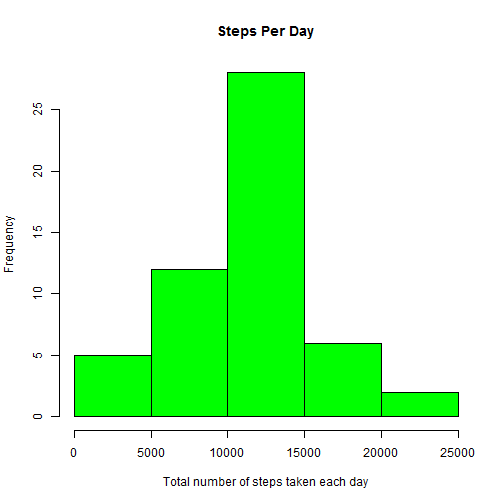
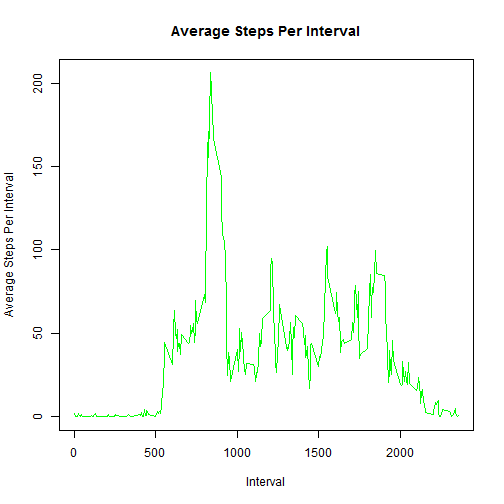
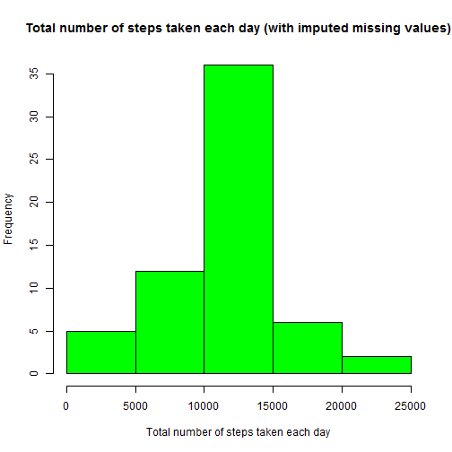
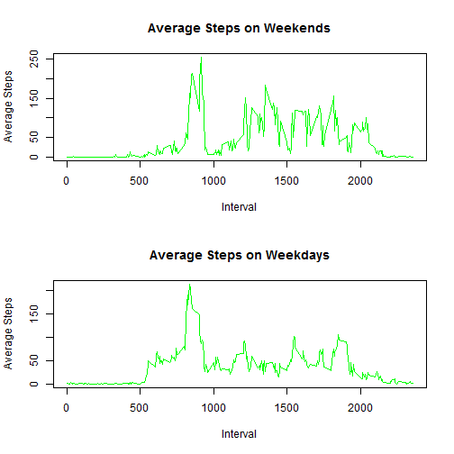

# Reproducible Research: Peer Assessment 1

This document contains the description of all the steps performed to answer the assignment questions. It it involves analysis of a personal activity monitoring data collected for one person over the interval of two months of October and November, 2012. The dataset analyzed covers the individuals' number of steps taken in 5 minute intervals each day of the measurement period.

## Loading and preprocessing the data

First, it is necessary to load the plyr package.

```r
library(plyr)
```


We load the data, convert the dates to the "date" type and transform the interval data.

```r
data <- read.csv("activity.csv")
data$date <- as.Date(data$date)
data$interval <- formatC(data$interval, width = 4, flag = 0)
```


Finally, we check the dataset.

```r
head(data)
```

```
##   steps       date interval
## 1    NA 2012-10-01     0000
## 2    NA 2012-10-01     0005
## 3    NA 2012-10-01     0010
## 4    NA 2012-10-01     0015
## 5    NA 2012-10-01     0020
## 6    NA 2012-10-01     0025
```


## What is mean total number of steps taken per day?
First, we make a histogram of the total number of steps taken each day.

```r
stepsPerDay <- ddply(data, "date", summarise, totalSteps = sum(steps))
with(stepsPerDay, hist(totalSteps, col = "green", main = "Steps Per Day", xlab = "Total number of steps taken each day"))
```

 


Second, we calculate the mean and median total number of steps taken per day.

```r
meanTotalSteps <- mean(stepsPerDay$totalSteps, na.rm = TRUE)
medianTotalSteps <- median(stepsPerDay$totalSteps, na.rm = TRUE)
```

The results are following:
- mean total number of steps: 1.0766 &times; 10<sup>4</sup> steps  
- median total number of steps: 10765 steps


## What is the average daily activity pattern?
We plot the average number of steps for each 5-minute interval, averaged over all days of the measurement period.

```r
avgStepsPerInterval <- ddply(data, "interval", summarise, avgStepsPerInterval = mean(steps, 
    na.rm = TRUE))
with(avgStepsPerInterval, plot(interval, avgStepsPerInterval, col = "green", 
    type = "l", xlab = "Interval", ylab = "Average Steps Per Interval", main = "Average Steps Per Interval"))
```

 

```r
maxInterval <- avgStepsPerInterval$interval[which.max(avgStepsPerInterval$avgStepsPerInterval)]
```

The 5-minute interval which contains the maximum number of steps on average is 0835. This might be about the time the person goes to work.

## Imputing missing values
First, we calculate the total number of missing values.

```r
numOfMissing <- sum(is.na(data$steps))
```

The total number of values missing from the dataset is 2304.

We create a new dataset that is equal to the original dataset but with the missing data filled in.For missing number of steps imputation, our strategy is to replace NAs within a 5-minute interval with the average number of steps for that interval over all days in the measurement period. First, we create a variable "imputedData", we add a column of averages for the particular intervals and replace NAs by those averages everywhere where there are missing values.

```r
imputedData <- data
imputedData <- merge(imputedData, avgStepsPerInterval, sort = TRUE)
imputedData$steps[is.na(imputedData$steps)] <- imputedData$avgStepsPerInterval[is.na(imputedData$steps)]
```

Then, we make a histogram of the total number of steps taken each day:

```r
stepsPerDayImputed <- ddply(imputedData, "date", summarise, totalSteps = sum(steps))
with(stepsPerDayImputed, hist(totalSteps, col = "green", main = "Total number of steps taken each day (with imputed missing values)", 
    xlab = "Total number of steps taken each day"))
```

 


Finally, we calculate the mean and median total number of steps taken per day based on the imputed dataset.

```r
meanTotalSteps_I = mean(stepsPerDayImputed$totalSteps)
medianTotalSteps_I = median(stepsPerDayImputed$totalSteps)
```


The results are following:
- mean total number of steps: 1.0766 &times; 10<sup>4</sup> steps  
- median total number of steps: 1.0766 &times; 10<sup>4</sup> steps
 
Imputing missing data does not change the mean (probably since we use means for imputation). The effect of the imputation on median is minimal.


## Are there differences in activity patterns between weekdays and weekends?
First, we create a new factor variable with two levels -- "weekday" and "weekend" indicating whether a given date is a weekday or weekend day. Please note that the day Names are influenced by the R's locale.

```r
finalData <- imputedData
finalData <- ddply(finalData, "date", transform, day = weekdays(date))
weekends <- finalData$day == "neděle" | finalData$day == "sobota"
finalData$subset <- "weekend"
finalData$subset[!weekends] <- "weekday"
finalData$subset <- as.factor(finalData$subset)
```

Second, we split the data to weekends and weekdays, and again we calculate the mean and median total number of steps taken per day for each of the two new datasets.

```r
weekends <- finalData[finalData$subset == "weekend", ]
avgWeekends <- ddply(weekends, "interval", summarise, avgSteps = mean(steps))
weekdays <- finalData[finalData$subset == "weekday", ]
avgWeekdays <- ddply(weekdays, "interval", summarise, avgSteps = mean(steps))
```


Finally, we plot these two new datasets to see if the pattern differs for weekdays and weekends:

```r
par(mfrow = c(2, 1))
with(avgWeekends, plot(interval, avgSteps, col = "green", type = "l", xlab = "Interval", 
    ylab = "Average Steps", main = "Average Steps on Weekends"))
with(avgWeekdays, plot(interval, avgSteps, col = "green", type = "l", xlab = "Interval", 
    ylab = "Average Steps", main = "Average Steps on Weekdays"))
```

 


As we can see in the output, the pattern is significantly different on weekends. The person seems to be getting up later on weekends. Also, instead of sitting at work, the person is clearly walking much more from approx. 10:00AM until the evening.


